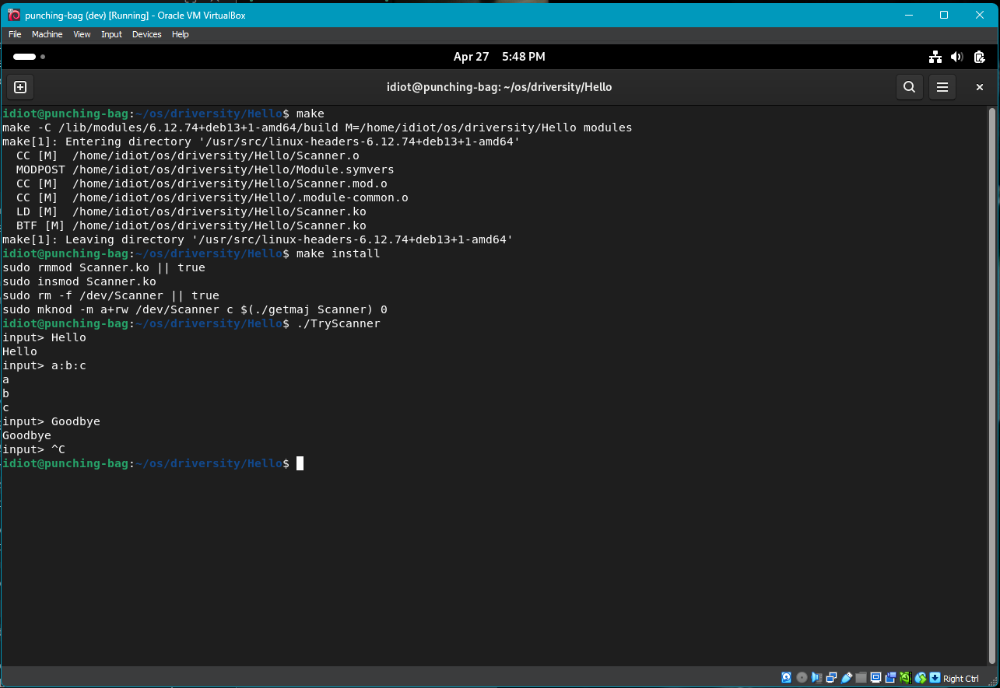
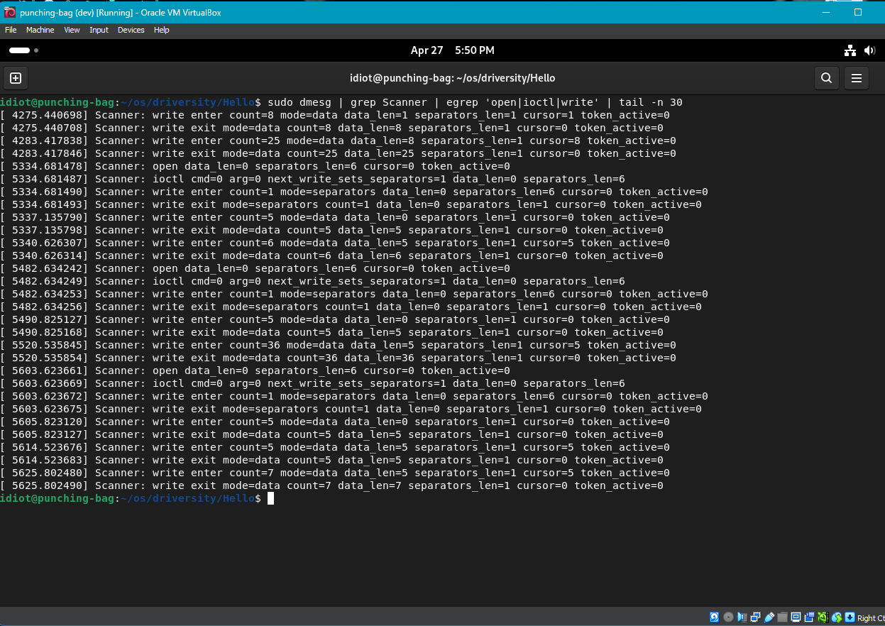

# HW5 Scanner Driver

This folder contains my HW5 kernel-module solution for the `Scanner` character
device.

## Files

- `Scanner.c`: kernel module implementation
- `Scanner.h`: documented types and helper declarations
- `TryScanner.c`: simple user-space test program
- `ScannerTest.c`: automated user-space test suite
- `Makefile`: builds the module and test program
- `getmaj`: helper script used by `make install`

## Build

From `hw5/Hello`:

```sh
make
make TryScanner
make ScannerTest
```

## Load On The VM

```sh
sudo make install
ls -l /dev/Scanner
```

This assignment is only loaded and tested on the VirtualBox VM, not on the
host machine.

## Unload

```sh
sudo make uninstall
```

## Scanner Behavior

The device acts like a token scanner.

- `ioctl(fd, 0, 0)` means the next `write()` replaces the separator set
- a normal `write()` replaces the current input data
- `read()` returns:
- `> 0` for token bytes
- `0` for end-of-token
- `-1` for end-of-data

Each open file descriptor gets its own scanner state, including separators,
input data, and tokenization progress.

## Example

`TryScanner` sets `:` as the separator and then reads input lines from the
terminal.

Example interaction:

```text
$ ./TryScanner
input> a:b:c
a
b
c
input>
```

## Test Suite

The grading-sensitive part of this assignment is the exact `read()` contract, so
I added an automated test program that checks the return-value sequence for many
edge cases.

Build and run it on the VM after the module is installed:

```sh
make ScannerTest
./ScannerTest
```

Or:

```sh
make test
```

The suite covers:

- empty input
- one token
- multiple tokens
- leading and trailing separators
- repeated separators
- input with no separators present
- empty separator set
- token reads split across multiple `read()` calls
- `read(fd, ..., 1)` behavior
- input containing only separators
- multiple writes replacing earlier data and resetting scan state
- `ioctl(fd, 0, 0)` affecting exactly one subsequent write
- independent state for separate opens of `/dev/Scanner`

The important pattern each case verifies is:

- positive return values while token bytes remain
- exactly one `0` at end-of-token
- `-1` at end-of-data

## Suggested Proof For Grading

To demonstrate correctness clearly in the VM, capture:

```sh
make
make ScannerTest
sudo make install
./ScannerTest
sudo dmesg | tail -n 80
```

Useful screenshots/logs:

- one screenshot of the full `./ScannerTest` PASS summary
- one screenshot or pasted log showing a chunked-read case succeeding
- one screenshot of `dmesg` showing `read enter` / `read exit` around a token
  boundary, especially a case where the driver returns token bytes, then `0`,
  then `-1`

## Demo


## Debug Logging

Temporary debug logging is intentionally left in `Scanner.c` to show:

- `open`
- `ioctl`
- separator writes vs data writes
- write byte counts
- `data_len` and `separators_len`
- `read()` state such as `cursor`, `token_active`, and `pending_token_end`

Example:


These messages can be viewed with:

```sh
sudo dmesg | grep Scanner
```
